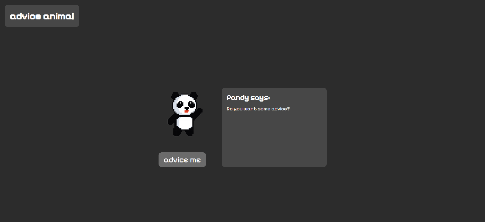

# React + TypeScript + Vite + SASS

## Assignment One: App Two

I made a desktop animal friend that gives you advice. 

When the user clicks the button a call to an API is made, and depending on if the request has been fully processed a loading component is shown which is made using framer-motion. With this small application I had some fun making the button interactive on hover and on active using the corresponding css pseudo-classes. It also includes react components and props to structure the files in a more readable way. 

I also tried unit-testing using Jest for the first time! It was a fun and challenging task to do on my own with a bit of help from google. 

This assignment was part of the Web & App development course. 
## Preview

[Click here to view the live website.](https://advice-animal.vercel.app/)

## Grading

G

- Written in TypseScript
- Connect to an external API
- Displays data from the API
- User fired event triggers an API call
- Uses one of Styled Components, Tailwind or Sass for styling
- Must have a responsive design

VG

- Consistently organized files and naming conventions
- Practical application of useState and useEffect
- State is changed
- Each App uses a different approach to styling
- Shows an application of the features of the styling library (eg if Tailwind I would expect to see theme extension/ overrides and almost no CSS)

## Feedback from teacher

You are welcomed to write your feedback here Rob! :D 